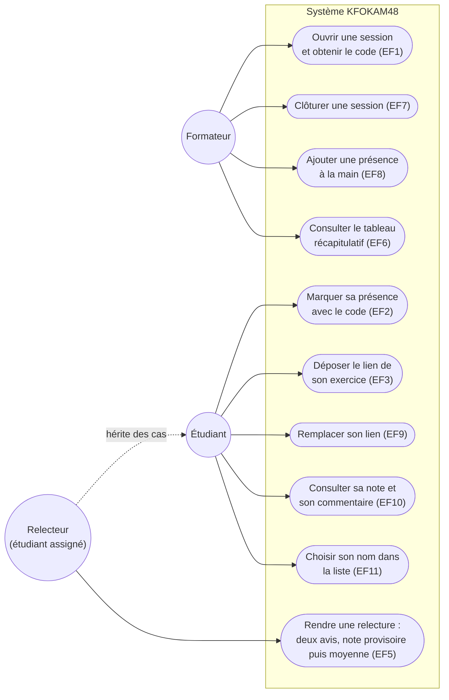

# D1 — Diagramme de cas d'utilisation

> Le relecteur n'est pas un acteur distinct : c'est un étudiant dans un état
> d'assignation (voir cahier des charges §2). Il apparaît comme spécialisation.

**Contrôles associés (cas d'erreur du contrat) :**

- UC5 : `400 CODE_INCONNU` · `409 DEJA_PRESENT` (RG16) · `410 CODE_EXPIRE` (RG1) · refus après clôture (RG2)
- UC6 : `400 LIEN_INVALIDE` · `409 EXERCICE_DEJA_DEPOSE` (RG17) · refus après clôture (RG10)
- UC10 : `400 NOTE_INVALIDE` (RG7) · `403 AUTO_RELECTURE` (RG4) · `409 RELECTURE_DEJA_RENDUE` (RG8)
- UC4 : `404 PROMOTION_INCONNUE`
