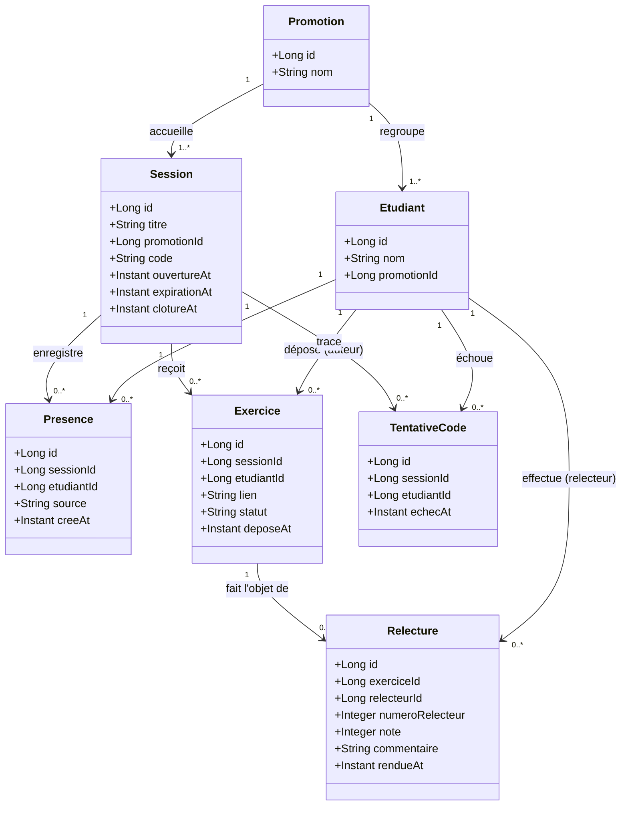

# D2 — Modèle de données (classes)

> Ce diagramme est le modèle cible ; il devra correspondre à la migration Flyway `V1__init.sql`, qui sera créée à l'étape suivante.
> Toute évolution du schéma à l'étape 3 se fera dans une **nouvelle migration**
> `V2__...` et ce diagramme est mis à jour avec `V3__double_relectures.sql`.

**Notes de conception :**

- **Pas d'entité Relecteur** : le relecteur est un `Etudiant` référencé par `Relecture.relecteurId` (décision §2 du cahier des charges, Q7).
- `Presence.source` ∈ `{ETUDIANT, FORMATEUR}` (Q14, champ imposé par le contrat).
- `Exercice.statut` ∈ `{EN_ATTENTE, ASSIGNE, RELU}` — cycle de vie détaillé dans D4.
- `Exercice.etudiantId` = l'**auteur** ; `Relecture.relecteurId` = celui qui relit ; `numeroRelecteur` vaut 1 ou 2 pour distinguer les places. Un étudiant apparaît donc dans les deux rôles.
- `Session.clotureAt` est `null` tant que le formateur n'a pas clôturé (Q3, Q12).
- `TentativeCode` est prévu pour le blocage de 2 minutes après 5 échecs (Q4, RG3), exigence **Could EF12 / issue #11** différée et non livrée à l’étape 3.
- Contraintes d'unicité : `(session_id, etudiant_id)` unique sur `presence` (RG16) et sur `exercice` (RG17), `(exercice_id, numero_relecteur)` et `(exercice_id, relecteur_id)` sur `relecture` ; `code` unique parmi les sessions non expirées (RG18).
- **Q10/H9 tranché** : la correction met à jour la même `Relecture` (pas d'historique de versions) ; aucune colonne supplémentaire n'était nécessaire, `rendue_at` conserve la date de la création initiale.
