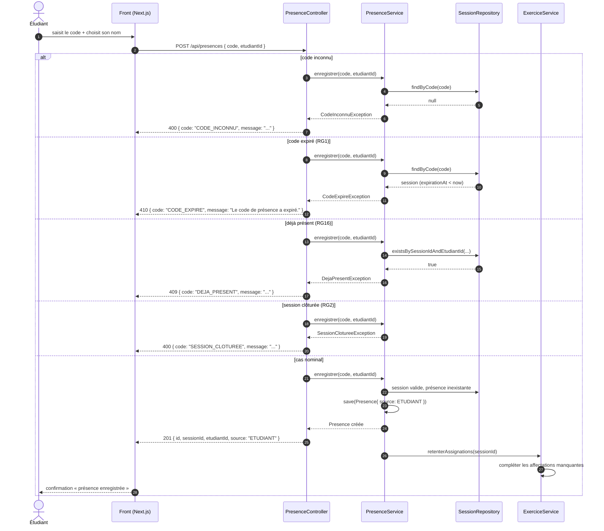

# D3 — Séquence : « marquer sa présence »

> Cas nominal **et** trois cas d'erreur, conformes aux codes HTTP du contrat :
> `201` nominal · `400 CODE_INCONNU` · `410 CODE_EXPIRE` (RG1) · `409 DEJA_PRESENT` (RG16).
> La clôture préalable de la session renvoie `400 SESSION_CLOTUREE` (RG2, hypothèse H5).

**Points de cohérence vérifiés :**

- `findByCode` verrouille la session pendant l’enregistrement de présence ; après chaque nouvelle présence, les affectations manquantes des exercices non `RELU` sont complétées. Les deux relecteurs sont distincts de l’auteur et l’un de l’autre (RG4–RG6, RG14).

- Après chaque présence, `ExerciceService` complète les affectations manquantes des exercices non `RELU` ; le premier candidat ne peut être l’auteur, le second ne peut être ni l’auteur ni le premier relecteur (RG4–RG6, RG14).

- Les quatre erreurs passent toutes par le `@RestControllerAdvice` (B4) : format `{code, message}` garanti, aucune stack trace.
- L'ordre des vérifications dans le service : existence du code → expiration (RG1) → clôture (RG2) → unicité de la présence (RG16). C'est cet ordre qui rend les codes HTTP prévisibles.
- `source=ETUDIANT` : une présence créée par le formateur (EF8) passerait par un autre endpoint et porterait `source=FORMATEUR` (Q14).
