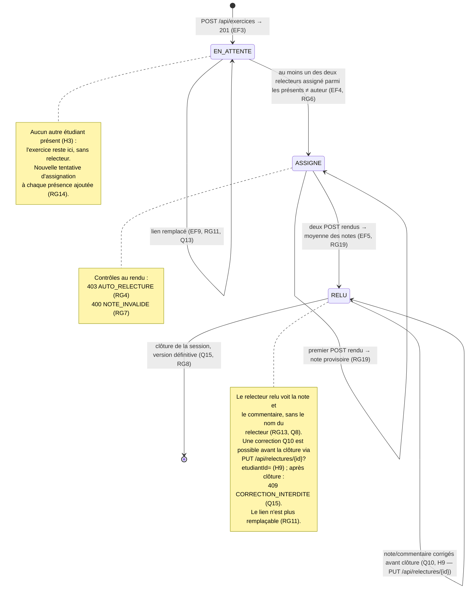

# D4 (bonus) — États-transitions du cycle de vie d'un exercice

> Bonus +3 du sujet. Le statut est porté par `Exercice.statut` (voir D2).

**Règles associées :**

- La clôture de la session (EF7) ne change pas le statut d'un exercice : un exercice `EN_ATTENTE` ou `ASSIGNE` reste visible comme tel dans le tableau (Q11, RG9) via `relecturesEnAttente`.
- Une correction Q10 conserve le statut `RELU` et ne constitue pas une seconde création ; le `POST` imposé reste protégé par `409 RELECTURE_DEJA_RENDUE`. H9 tranché : correction via `PUT /api/relectures/{id}?etudiantId=`, fermée après clôture (`409 CORRECTION_INTERDITE`). La soumission initiale reste possible après clôture (H10).
