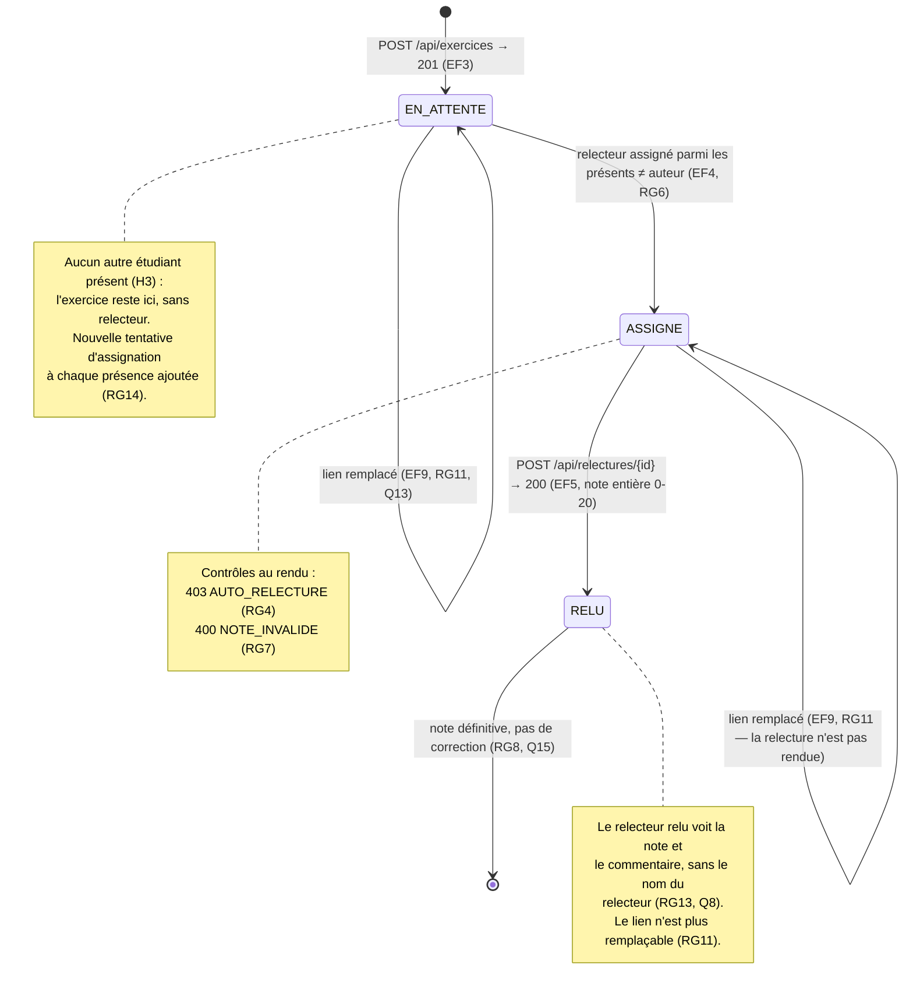

# D4 (bonus) — États-transitions du cycle de vie d'un exercice

> Bonus +3 du sujet. Le statut est porté par `Exercice.statut` (voir D2).

**Règles associées :**

- La clôture de la session (EF7) ne change pas le statut d'un exercice : un exercice `EN_ATTENTE` ou `ASSIGNE` reste visible comme tel dans le tableau (Q11, RG9) via `relecturesEnAttente`.
- Transition impossible par construction : `RELU → ASSIGNE` ou `RELU → EN_ATTENTE` — la relecture rendue est définitive (RG8), le contrat renvoie `409 RELECTURE_DEJA_RENDUE`.
